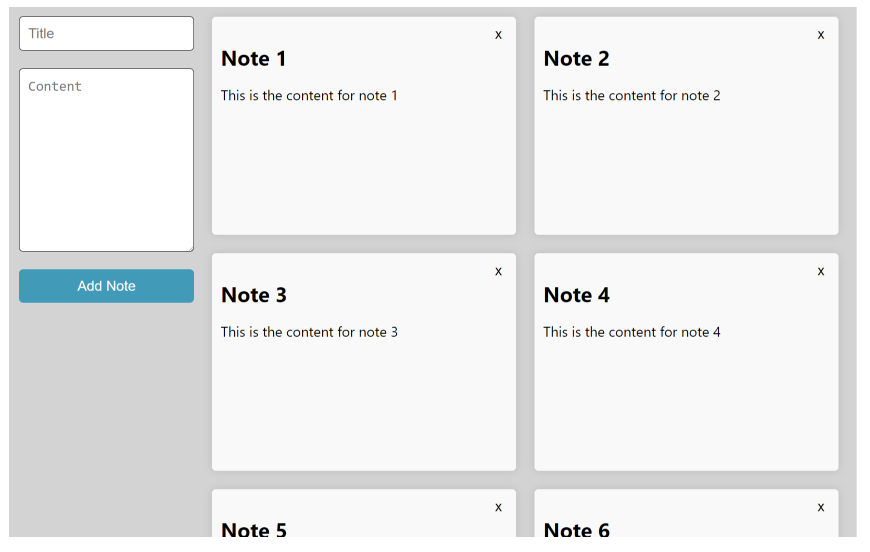

# Challenge React

Notes app

Implement the following features on the application

- Read a list of notes.
- Add a new note using the mouse (clicking) a button or keyboard.
- delete any note, using the mouse or keyboard.
- edit any note, using the mouse (clicking in a icon) or keyboard.

Each note must have a title, content;

## Layout

You need to follow this layout.

Obs: To edit a note, you’ll add an icon in each note, once its clicked, will replace the `add note` form to `edit note` form 

Please, use `javascript` to build this project